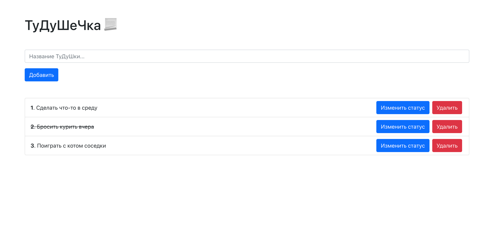

# TODO лист с использованием LocalStorage

[Ссылка на проект](http://todo.viil.ru/)

## Стек: React, Redux, Bootstrap 

### Для запуска проекта

- Склонировать проект
- Инициализировать проект - yarn
- Запустить проект - `yarn start`

### Preview проекта

